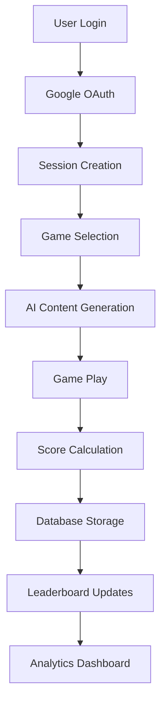

# VH Website Documentation

## Overview

Welcome to the VH Website documentation! This comprehensive guide covers all aspects of the educational platform, from system architecture to component design. The VH Website is a modern, full-stack application built with Next.js 15, featuring educational games, university admission tools, and a robust authentication system.

## 📚 Documentation Index

### Core System Documentation

1. **[System Architecture](./system-architecture.md)**
   - High-level system overview with diagrams
   - Component interconnections and data flow
   - Performance and scalability considerations
   - External service integrations

2. **[Authentication System](./authentication-system.md)**
   - NextAuth.js implementation with Google OAuth
   - Access control and user management
   - Session handling and security features
   - Role-based permissions system

3. **[Pages and Routing](./pages-and-routing.md)**
   - Next.js 15 App Router structure
   - File-based routing patterns
   - Protected route implementation
   - Navigation and user experience

### Feature Documentation

4. **[Games System](./games-system.md)**
   - Vocabulary Quiz with AI question generation
   - Mental Math Trainer with advanced scoring
   - Leaderboard systems and performance tracking
   - Database integration and analytics

5. **[Design System](./design-system.md)**
   - VH brand colors and typography
   - Tailwind CSS component patterns
   - Animation and interaction design
   - Responsive design principles

### Implementation Guides

6. **[Component Library](./components.md)**
   - Reusable UI component documentation
   - Usage examples and best practices
   - Design patterns and conventions
   - Accessibility considerations

7. **[Deployment Guide](./deployment.md)**
   - Production deployment to Vercel
   - Environment configuration
   - Build processes and optimization
   - Monitoring and maintenance

## 🏗️ System Architecture Overview

The VH Website is built on a modern tech stack:

- **Frontend**: Next.js 15 with App Router, React, Tailwind CSS
- **Backend**: Next.js API Routes, MongoDB with Mongoose
- **Authentication**: NextAuth.js with Google OAuth
- **AI Integration**: Google Gemini API for content generation
- **Deployment**: Vercel with automated CI/CD

## 🎮 Key Features

### Educational Games
- **Vocabulary Quiz**: AI-generated questions from 10 vocabulary sections (1000+ words)
- **Mental Math Trainer**: Multi-operation practice with 4 difficulty levels

### University Tools
- **Eligibility Checker**: Calculate admission probabilities for multiple universities
- **Course Information**: Detailed course descriptions and requirements

### Administrative Features
- **User Management**: Role-based access control system
- **Analytics Dashboard**: Performance tracking and insights
- **Content Management**: Dynamic content generation and updates

## 🔧 Technical Highlights

### Performance Optimizations
- Build-time access control generation
- Optimized database queries with MongoDB aggregation
- Efficient caching strategies
- Code splitting and lazy loading

### Security Features
- OAuth-based authentication
- Session management with JWT tokens
- Role-based access control
- Input validation and sanitization

### User Experience
- Responsive design for all devices
- Accessibility compliance (WCAG AA)
- Progressive web app capabilities
- Real-time feedback and animations

## 📖 Getting Started

### For Developers
1. Start with [System Architecture](./system-architecture.md) for the big picture
2. Review [Authentication System](./authentication-system.md) to understand user management
3. Explore [Games System](./games-system.md) for the core educational features
4. Study [Design System](./design-system.md) for UI/UX guidelines

### For Designers
1. Begin with [Design System](./design-system.md) for brand guidelines
2. Review [Component Library](./components.md) for reusable patterns
3. Check [Pages and Routing](./pages-and-routing.md) for page layouts

### For Administrators
1. Read [Authentication System](./authentication-system.md) for user management
2. Study [Games System](./games-system.md) for understanding analytics
3. Review [Deployment Guide](./deployment.md) for maintenance procedures

## 🚀 Quick Navigation

| Component | Description | Key Features |
|-----------|-------------|--------------|
| **Homepage** | Landing page with feature overview | Hero section, navigation hub, responsive design |
| **Vocabulary Quiz** | AI-powered vocabulary learning | 10 sections, difficulty levels, leaderboards |
| **Mental Math** | Mathematical skill trainer | 4 operations, time limits, dual leaderboards |
| **Authentication** | Secure login system | Google OAuth, role-based access, session management |
| **Eligibility Checker** | University admission tool | Multi-university support, probability calculations |

## 📊 Data Flow Summary

## 🔍 Troubleshooting Common Issues

### Authentication Problems
- Check Google OAuth configuration
- Verify user email in access control list
- Review session cookie settings

### Game Issues
- Ensure AI API keys are configured
- Check database connection status
- Verify score calculation logic

### Performance Concerns
- Review database query optimization
- Check caching implementation
- Monitor API response times

## 📞 Support and Maintenance

For system support and maintenance:
1. Check the [Deployment Guide](./deployment.md) for common issues
2. Review error logs in Vercel dashboard
3. Monitor database performance in MongoDB Atlas
4. Update dependencies regularly for security

## 🎯 Future Enhancements

The documentation covers current features and architecture. For planned enhancements:
- Multiplayer game modes
- Advanced analytics dashboard
- Mobile app development
- Offline functionality
- Additional educational games

---

**Last Updated**: January 2025
**Version**: 1.0.0
**Documentation Coverage**: Complete system architecture, authentication, games, design system, and deployment

This documentation is maintained alongside code changes to ensure accuracy and completeness.