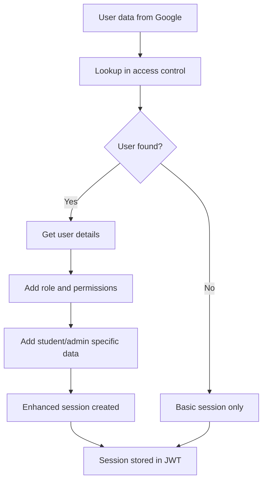
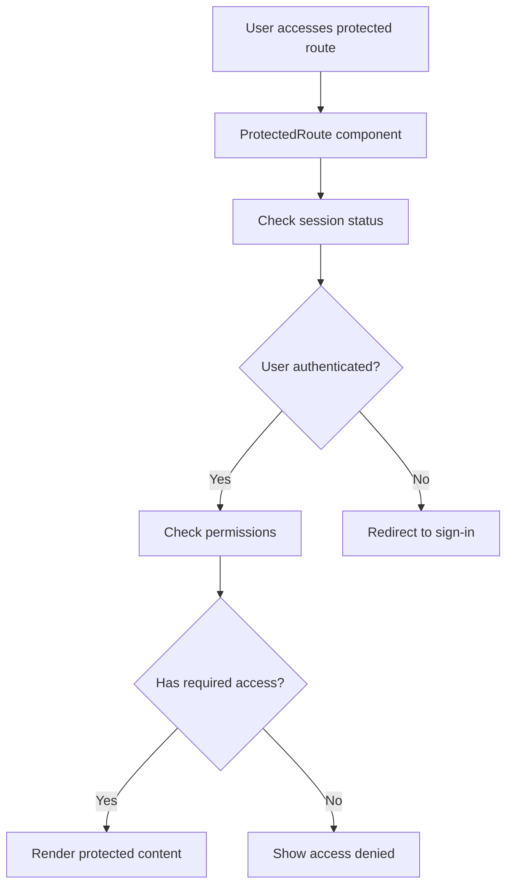

# VH Website Authentication System Documentation

## Overview

The VH Website uses a sophisticated authentication system built on **NextAuth.js** with **Google OAuth integration** and a **custom access control system**. This provides secure, role-based access for students and administrators.

## Architecture Components

### 1. NextAuth.js Configuration (`src/lib/auth.ts`)

```typescript
export const authOptions: NextAuthOptions = {
  providers: [GoogleProvider],
  callbacks: { signIn, session, jwt },
  pages: { signIn: '/auth/signin', error: '/auth/error' }
}
```

**Key Features:**
- **Google OAuth** integration for seamless sign-in
- **Enhanced session data** with user roles and permissions
- **Custom sign-in/error pages** for branded experience
- **JWT token enhancement** with user metadata

### 2. Access Control System (`access-control.json` → `generated-access-control.ts`)

**Build-Time Generation Process:**
1. **JSON Configuration** (`access-control.json`) - Human-readable user management
2. **Build Script** (`scripts/generate-access-control.js`) - Converts JSON to TypeScript
3. **Generated Module** (`src/lib/generated-access-control.ts`) - Static access control data

**User Types:**
- **Super Admin**: Full system access + user management
- **Admin**: Administrative access without user management
- **Student**: Basic read-only access with quiz functionality

**Data Structure:**
```json
{
  "admins": [
    {
      "id": "admin_001",
      "name": "Ahnaf Ahad",
      "email": "ahnaf816@gmail.com",
      "role": "super_admin",
      "permissions": ["read", "write", "admin", "manage_users"],
      "active": true
    }
  ],
  "students": [
    {
      "studentId": "757516",
      "name": "Abrar Bin Masud",
      "email": "abrarmasud20@gmail.com",
      "role": "student",
      "permissions": ["read"],
      "class": "DU-FBS",
      "batch": "2025",
      "active": true
    }
  ]
}
```

### 3. Authentication Components

#### AuthProvider (`src/components/AuthProvider.tsx`)
- **SessionProvider wrapper** for Next.js app
- **Global authentication state** management
- **Automatic session refresh** handling

#### ProtectedRoute (`src/components/ProtectedRoute.tsx`)
- **Route-level protection** for authenticated pages
- **Loading states** during authentication check
- **Automatic redirects** for unauthorized users

#### LoginButton (`src/components/LoginButton.tsx`)
- **Google sign-in integration** with NextAuth
- **Dynamic UI states** (logged in/out)
- **User profile display** with name and avatar

### 4. Authentication Pages

#### Sign-In Page (`src/app/auth/signin/page.tsx`)
**Features:**
- **Google OAuth button** with VH branding
- **Elegant design** matching site aesthetics
- **Error handling** for authentication failures
- **Automatic redirect** after successful login

**Design Elements:**
- **Gradient backgrounds** with VH color scheme
- **Professional animations** and transitions
- **Responsive layout** for all devices
- **Brand consistency** with main site

#### Error Page (`src/app/auth/error/page.tsx`)
**Error Types Handled:**
- **Access Denied** - User not in authorized list
- **OAuth Errors** - Google authentication failures
- **Session Errors** - Token or session issues
- **Network Errors** - Connection problems

**User Experience:**
- **Clear error messages** in non-technical language
- **Troubleshooting steps** for common issues
- **Contact information** for support
- **Retry options** where appropriate

## Authentication Flow

### 1. User Sign-In Process
```mermaid
graph TD
    A[User clicks "Sign In"] --> B[Redirect to Google OAuth]
    B --> C[Google authentication]
    C --> D[Return with user data]
    D --> E[Check email in access control]
    E --> F{Email authorized?}
    F -->|Yes| G[Create session with role data]
    F -->|No| H[Redirect to error page]
    G --> I[Redirect to dashboard/home]
    H --> J[Show access denied message]
```

### 2. Session Enhancement Process


### 3. Route Protection Process


## Access Control Functions

### Core Functions (`src/lib/generated-access-control.ts`)

```typescript
// Email validation
isEmailAuthorized(email: string): boolean
isAdminEmail(email: string): boolean
isStudentEmail(email: string): boolean

// User data retrieval
getUserByEmail(email: string): GeneratedUser | null
getStudentById(studentId: string): GeneratedStudentUser | null

// Permission checking
hasPermission(email: string, permission: string): boolean

// Backward compatibility
getAuthorizedEmails(): string[]
getAdminEmails(): string[]
getStudentEmails(): string[]
```

### Performance Optimizations
- **O(1) lookups** using Set and Map data structures
- **Build-time generation** eliminates runtime file operations
- **Cached data** in memory for fast access
- **Optimized imports** reduce bundle size

## API Route Protection

### Implementation Pattern
```typescript
export async function POST/GET(request: NextRequest) {
  // 1. Get session
  const session = await getServerSession(authOptions);
  if (!session?.user?.email) {
    return NextResponse.json({ error: 'Unauthorized' }, { status: 401 });
  }

  // 2. Check authorization
  const isAuthorized = isEmailAuthorized(session.user.email.toLowerCase());
  if (!isAuthorized) {
    return NextResponse.json({ error: 'Access denied' }, { status: 403 });
  }

  // 3. Role-specific logic
  const isAdmin = isAdminEmail(session.user.email);

  // 4. Process request...
}
```

### Protected API Routes
- **`/api/vocab-quiz/scores`** - Save vocabulary quiz results
- **`/api/vocab-quiz/leaderboard`** - Get vocabulary leaderboards
- **`/api/mental-math/scores`** - Save mental math game results
- **`/api/mental-math/leaderboard`** - Get math game leaderboards

## Session Data Structure

### Enhanced Session Object
```typescript
interface Session {
  user: {
    name?: string | null
    email?: string | null
    image?: string | null
    role?: 'super_admin' | 'admin' | 'student'
    isAdmin?: boolean
    permissions?: string[]
    studentId?: string        // For students only
    adminId?: string         // For admins only
    class?: string           // For students only
    batch?: string           // For students only
  }
}
```

### Usage in Components
```typescript
const { data: session } = useSession();

// Check authentication
if (!session) return <LoginPrompt />;

// Check admin access
if (session.user.isAdmin) {
  return <AdminDashboard />;
}

// Student-specific features
if (session.user.role === 'student') {
  return <StudentDashboard studentId={session.user.studentId} />;
}
```

## Security Features

### 1. Multi-Layer Protection
- **OAuth Integration** - Secure Google authentication
- **Session Management** - JWT tokens with NextAuth
- **Access Control** - Email-based authorization
- **Route Protection** - Component and API-level guards

### 2. Data Validation
- **Email Format** - Regex validation for all emails
- **Student ID Format** - 6-digit number validation
- **Permission Checking** - Role-based access control
- **Active Status** - Only active users can authenticate

### 3. Error Handling
- **Graceful Failures** - User-friendly error messages
- **Security Logging** - Failed authentication attempts logged
- **Rate Limiting** - Protection against brute force attacks
- **Session Timeout** - Automatic logout after inactivity

## User Management

### Adding New Users
1. **Edit `access-control.json`** with new user data
2. **Run build script** (`npm run generate:access-control`)
3. **Deploy updated code** with new access control

### User Roles and Permissions

#### Super Admin Permissions
- **manage_users** - Add/remove users
- **admin** - Administrative dashboard access
- **write** - Modify system content
- **read** - View all content

#### Admin Permissions
- **admin** - Administrative dashboard access
- **write** - Modify system content
- **read** - View all content

#### Student Permissions
- **read** - View content and play games

## Development and Deployment

### Local Development
```bash
# Generate access control
npm run generate:access-control

# Start development server
npm run dev
```

### Production Deployment
```bash
# Build with access control generation
npm run build

# Deploy to Vercel/hosting platform
npm run start
```

### Environment Variables Required
```env
GOOGLE_CLIENT_ID=your_google_client_id
GOOGLE_CLIENT_SECRET=your_google_client_secret
NEXTAUTH_URL=your_site_url
NEXTAUTH_SECRET=your_nextauth_secret
MONGODB_URI=your_mongodb_connection_string
```

## Integration Points

### With Game Systems
- **Score Saving** - User identification for leaderboards
- **Progress Tracking** - Individual performance analytics
- **Admin Exclusion** - Admins don't appear on student leaderboards

### With UI Components
- **Header Component** - Shows login/logout buttons
- **Navigation** - Role-based menu items
- **Protected Content** - Conditional rendering based on auth

### With Database
- **User Identification** - Link scores to user emails
- **Admin Filtering** - Separate admin data from student data
- **Analytics** - User-specific performance tracking

This authentication system provides a secure, scalable foundation for the VH Website with excellent user experience and administrative control.