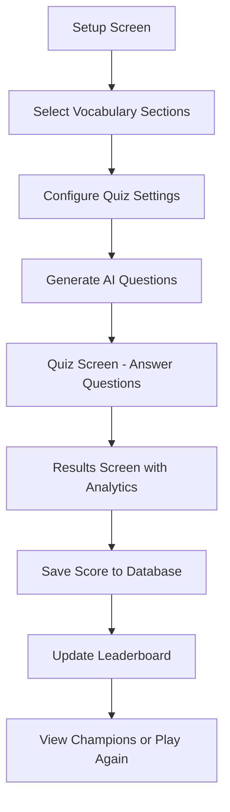
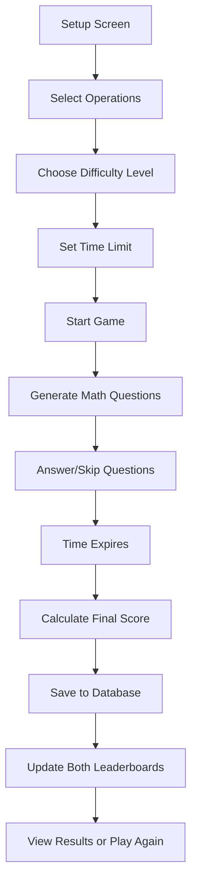

# VH Website Games System Documentation

## Overview

The VH Website features two sophisticated educational games designed to help students improve their academic skills: **Vocabulary Quiz** and **Mental Math Trainer**. Both games include AI-powered content generation, comprehensive analytics, and competitive leaderboards.

## Game Architecture

### 1. Vocabulary Quiz System (`src/app/games/vocab-quiz/page.tsx`)

#### Core Features
- **AI-Generated Questions** using Google Gemini API
- **10 Vocabulary Sections** with 1000+ words total
- **Dynamic Question Generation** with difficulty levels
- **Real-time Performance Tracking**
- **Comprehensive Leaderboards** based on lifetime questions answered
- **Detailed Explanations** for learning reinforcement

#### Game Flow


#### Technical Implementation

**Vocabulary Sections Structure:**
```typescript
const vocabularySections: { [key: number]: string[] } = {
  1: ["abash", "abate", "abdicate", ...], // 70+ words
  2: ["apathy", "aphorism", "apocalypse", ...], // 70+ words
  // ... up to section 10
  10: ["sordid", "spawn", "specious", ...] // 70+ words
}
```

**Question Generation Process:**
1. **Section Selection** - Students choose 1-10 vocabulary sections
2. **Word Sampling** - Algorithm selects diverse words from chosen sections
3. **AI Prompt Construction** - Detailed prompt for question generation
4. **API Call to Gemini** - Generate contextual fill-in-the-blank questions
5. **Response Processing** - Parse and validate AI-generated content
6. **Question Distribution** - Balance of easy (33%), medium (50%), hard (17%)

**Question Format:**
```typescript
interface Question {
  sentence: string;        // "The politician's _______ speech convinced many voters."
  wordBank: string[];      // ["eloquent", "verbose", "terse", "rambling", ...]
  correctAnswer: string;   // "eloquent"
  difficulty: string;      // "easy" | "medium" | "hard"
}
```

#### Scoring System
- **Basic Score** - Correct answers (+1), Wrong answers (-0.25)
- **Minimum Score** - Never goes below 0
- **Performance Metrics** - Accuracy percentage, time per question
- **Leaderboard Ranking** - Based on lifetime total questions answered

#### Database Integration

**VocabScore Model** (`src/lib/models/VocabScore.ts`):
```typescript
interface IVocabScore {
  playerEmail?: string;
  playerName?: string;
  questionsAnswered: number;
  questionsCorrect: number;
  totalSections: number;
  selectedSections: number[];
  difficulty: string;
  playedAt: Date;
  isAdmin?: boolean;
}
```

**API Endpoints:**
- **`POST /api/vocab-quiz/scores`** - Save quiz results
- **`GET /api/vocab-quiz/leaderboard`** - Fetch leaderboard data

#### Leaderboard System
**Aggregation Logic:**
```typescript
// Aggregate by player email, sum total questions answered
const leaderboard = await VocabScore.aggregate([
  { $match: { isAdmin: { $ne: true } } }, // Exclude admins
  {
    $group: {
      _id: '$playerEmail',
      playerName: { $first: '$playerName' },
      totalQuestionsAnswered: { $sum: '$questionsAnswered' },
      totalQuestionsCorrect: { $sum: '$questionsCorrect' },
      gamesPlayed: { $sum: 1 },
      averageAccuracy: { $avg: { /* accuracy calculation */ } },
      lastPlayed: { $max: '$playedAt' },
      uniqueSectionsCount: { $size: '$uniqueSectionsPlayed' }
    }
  },
  { $sort: { totalQuestionsAnswered: -1 } }
]);
```

### 2. Mental Math Trainer (`src/app/games/mental-math/page.tsx`)

#### Core Features
- **Multi-Operation Support** (Addition, Subtraction, Multiplication, Division)
- **4 Difficulty Levels** (Easy, Medium, Hard, Extreme)
- **Flexible Time Limits** (30 seconds to 5 minutes)
- **Advanced Scoring System** with bonuses and penalties
- **Dual Leaderboards** (Individual scores + Accumulated performance)
- **Real-time Question Generation** with uniqueness checking

#### Game Flow


#### Question Generation Algorithm

**Difficulty-Based Number Ranges:**
```typescript
// Addition examples by difficulty
easy: num1(1-9) + num2(1-9)           // 2 + 7 = 9
medium: num1(10-99) + num2(1-9)       // 45 + 6 = 51
hard: num1(10-99) + num2(10-99)       // 67 + 84 = 151
extreme: num1(50-199) + num2(50-199)  // 156 + 87 = 243 (max 200)
```

**Operation-Specific Logic:**
- **Division** - Always results in whole numbers (no decimals)
- **Subtraction** - Always positive results
- **Multiplication** - Reasonable product ranges per difficulty
- **Uniqueness Check** - No duplicate questions in same session

#### Advanced Scoring System

**Base Points by Difficulty:**
```typescript
const basePoints = {
  easy: 10,
  medium: 15,
  hard: 25,
  extreme: 40
}
```

**Multiplier System:**
- **Difficulty Multiplier** - Easy: 1x, Medium: 1.5x, Hard: 2x, Extreme: 3x
- **Operation Bonus** - Addition: 1x, Subtraction: 1.2x, Multiplication: 1.5x, Division: 1.8x
- **Multi-Operation Bonus** - +30% when multiple operations selected
- **Speed Bonus** - Up to 1.5x for answers under 3 seconds

**Penalties:**
- **Wrong Answer** - 50% of base points deducted
- **Skipped Question** - 30% of base points deducted
- **Minimum Score** - Score can go negative (realistic consequences)

#### Database Integration

**MathScore Model** (`src/lib/models/MathScore.ts`):
```typescript
interface IMathScore {
  playerEmail?: string;
  playerName?: string;
  score: number;
  questionsCorrect: number;
  questionsAnswered: number;
  accuracy: number;
  difficulty: 'easy' | 'medium' | 'hard' | 'extreme';
  operations: string[];
  timeLimit: number;
  playedAt: Date;
  isAdmin?: boolean;
}
```

**API Endpoints:**
- **`POST /api/mental-math/scores`** - Save game results
- **`GET /api/mental-math/leaderboard`** - Fetch both leaderboard types

#### Dual Leaderboard System

**1. Individual Scores Leaderboard:**
- **Top single-game performances**
- **Sorted by highest score**
- **Shows game-specific details** (difficulty, operations, accuracy)

**2. Accumulated Scores Leaderboard:**
- **Lifetime performance across all games**
- **Total points accumulated**
- **Average score and games played**
- **Overall accuracy percentage**

## AI Integration

### Google Gemini API Integration

**Configuration:**
- **Model**: `gemini-2.5-flash-lite`
- **API Key**: Stored in environment variable
- **Rate Limiting**: Managed through try-catch blocks
- **Fallback Handling**: Graceful degradation on API failures

**Prompt Engineering for Vocabulary Quiz:**
```javascript
const prompt = `Generate ${questionCount} fill-in-the-blank vocabulary questions using words from this list: ${selectedWords}.

Create ${hardCount} hard questions, ${mediumCount} medium questions, and ${easyCount} easy questions.

Format rules:
1. Each sentence should have ONE blank marked with _______
2. Word bank should have 8-10 words (include correct answer + distractors)
3. Questions should test contextual understanding
4. Use formal, academic language

Respond with JSON in this exact format:
{
  "questions": [
    {
      "sentence": "Complete sentence with _______",
      "wordBank": ["word1", "word2", "word3", "word4", "word5", "word6", "word7", "word8"],
      "correctAnswer": "correctword",
      "difficulty": "easy|medium|hard"
    }
  ]
}

DO NOT OUTPUT ANYTHING OTHER THAN VALID JSON.`;
```

**Response Processing:**
1. **Clean Response** - Remove markdown formatting
2. **Parse JSON** - Validate structure
3. **Filter Questions** - Ensure all required fields present
4. **Validate Count** - Confirm sufficient questions generated

### Error Handling and Resilience

**API Failure Scenarios:**
- **Network Issues** - Retry logic with exponential backoff
- **Invalid JSON** - Fallback to error message with troubleshooting
- **Rate Limiting** - User-friendly "try again later" messages
- **Partial Responses** - Use successfully generated questions if available

## Performance Optimizations

### Frontend Optimizations
- **Question Caching** - Store generated questions in component state
- **Optimistic Updates** - Update UI immediately, sync with server
- **Debounced Inputs** - Prevent excessive API calls
- **Lazy Loading** - Load leaderboards only when requested

### Backend Optimizations
- **Database Indexing** - Optimized queries for leaderboards
- **Aggregation Pipelines** - Efficient MongoDB aggregations
- **Admin Exclusion** - Filter admin scores at database level
- **Pagination** - Limit leaderboard results (top 20-50)

### Caching Strategy
- **Component-Level** - Cache questions during quiz session
- **API-Level** - Consider implementing Redis for leaderboard cache
- **Build-Time** - Static vocabulary word lists

## User Experience Features

### 1. Progressive Difficulty
- **Vocabulary**: Mixed difficulty with AI-generated complexity
- **Math**: Clear difficulty progression from basic to extreme

### 2. Feedback Systems
- **Immediate Feedback** - Correct/incorrect indicators
- **Detailed Explanations** - Vocabulary word definitions and context
- **Performance Analytics** - Accuracy trends and improvement suggestions

### 3. Competitive Elements
- **Leaderboards** - Multiple ranking systems
- **Rankings** - Position indicators and achievement levels
- **Social Features** - Compare with classmates

### 4. Accessibility
- **Keyboard Navigation** - Full keyboard support
- **Screen Reader** - Semantic HTML and ARIA labels
- **Mobile Responsive** - Touch-friendly interfaces
- **Color Contrast** - WCAG compliant color schemes

## Data Analytics and Insights

### Student Analytics
- **Performance Trends** - Accuracy over time
- **Strength Analysis** - Best performing areas
- **Improvement Areas** - Suggestions for focus
- **Comparative Metrics** - Class average comparisons

### Administrative Analytics
- **Usage Statistics** - Game popularity and engagement
- **Difficulty Analysis** - Question effectiveness
- **Performance Patterns** - Class-wide trends
- **Content Optimization** - Data-driven improvements

## Integration with Authentication System

### User Identification
- **Session-Based** - Automatic user detection
- **Score Attribution** - Link results to student accounts
- **Admin Exclusion** - Separate admin play from student competition

### Permission-Based Features
- **Student Access** - Game play and personal analytics
- **Admin Access** - Full analytics and user management
- **Role-Specific UI** - Different interfaces per user type

## Database Schema Design

### Optimized for Performance
```typescript
// Efficient indexes for fast queries
VocabScoreSchema.index({ questionsAnswered: -1, playedAt: -1 });
VocabScoreSchema.index({ playerEmail: 1, questionsAnswered: -1 });
VocabScoreSchema.index({ isAdmin: 1, questionsAnswered: -1 });

MathScoreSchema.index({ score: -1, playedAt: -1 });
MathScoreSchema.index({ playerEmail: 1, score: -1 });
MathScoreSchema.index({ isAdmin: 1, score: -1 });
```

### Data Integrity
- **Required Fields** - Enforce essential data
- **Validation** - Schema-level data validation
- **Consistency** - Atomic operations for score updates

## Future Enhancement Opportunities

### Content Expansion
- **More Vocabulary Sections** - Additional academic word lists
- **Custom Difficulty** - Student-specific challenge levels
- **Adaptive Learning** - AI-driven question selection

### Feature Additions
- **Multiplayer Modes** - Real-time competition
- **Achievement System** - Badges and rewards
- **Study Plans** - Personalized learning paths
- **Progress Tracking** - Long-term skill development

### Technical Improvements
- **Offline Support** - PWA capabilities
- **Real-time Updates** - WebSocket leaderboards
- **Advanced Analytics** - Machine learning insights
- **Performance Monitoring** - Detailed usage analytics

This games system provides engaging, educational experiences while maintaining high performance, security, and user experience standards.