# VH Website System Architecture Documentation

## Overview

The VH Website is a modern, full-stack educational platform built with **Next.js 15**, **MongoDB**, **NextAuth.js**, and **AI integration**. This document provides a comprehensive overview of how all system components connect and interact to deliver a seamless educational experience.

## High-Level Architecture

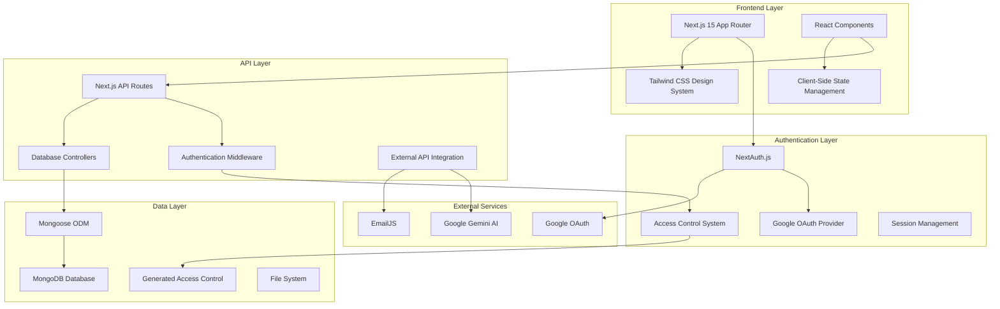

## Core System Components

### 1. Frontend Architecture

#### Next.js 15 App Router (`src/app/`)
- **File-based routing** for intuitive page organization
- **Server components** for optimal performance
- **Client components** for interactive features
- **Automatic code splitting** for fast loading

#### Component Hierarchy
```
├── Root Layout (AuthProvider, Header, Footer)
├── Public Pages (Home, Course Info, Registration)
├── Protected Pages (Games, Dashboards)
├── Authentication Pages (Sign-in, Error)
└── Shared Components (ProtectedRoute, UI Elements)
```

#### State Management Strategy
```typescript
// Component-level state for UI interactions
const [gameState, setGameState] = useState('setup');

// Session state via NextAuth
const { data: session } = useSession();

// Server state via API calls
const [leaderboard, setLeaderboard] = useState([]);
```

### 2. Authentication & Authorization System

#### NextAuth.js Integration
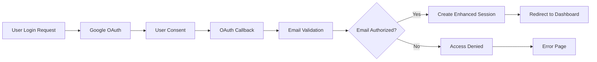

#### Access Control Flow
```typescript
// Build-time generation process
access-control.json → generate-access-control.js → generated-access-control.ts

// Runtime validation
API Request → Session Check → Email Authorization → Role Verification → Response
```

#### Permission Matrix
| Role | Read | Write | Admin | Manage Users | Games |
|------|------|-------|--------|--------------|-------|
| Student | ✅ | ❌ | ❌ | ❌ | ✅ |
| Admin | ✅ | ✅ | ✅ | ❌ | ✅ |
| Super Admin | ✅ | ✅ | ✅ | ✅ | ✅ |

### 3. Games System Architecture

#### Vocabulary Quiz Data Flow
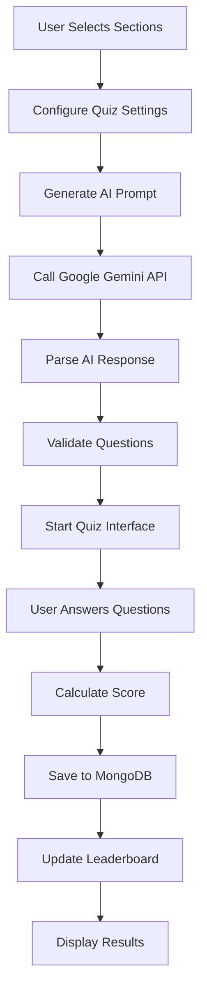

#### Mental Math Game Architecture
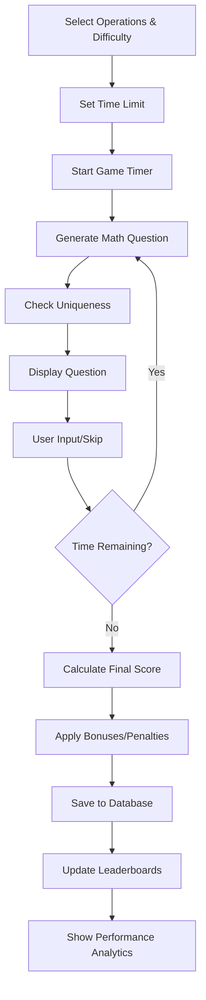

### 4. Database Architecture

#### MongoDB Schema Design
```typescript
// Collections Overview
├── mathscores          // Mental math game results
├── vocabscores         // Vocabulary quiz results
└── sessions            // NextAuth session storage

// Optimized Indexes
VocabScore: [questionsAnswered: -1, playedAt: -1]
MathScore: [score: -1, playedAt: -1]
Both: [playerEmail: 1, isAdmin: 1]
```

#### Data Relationships
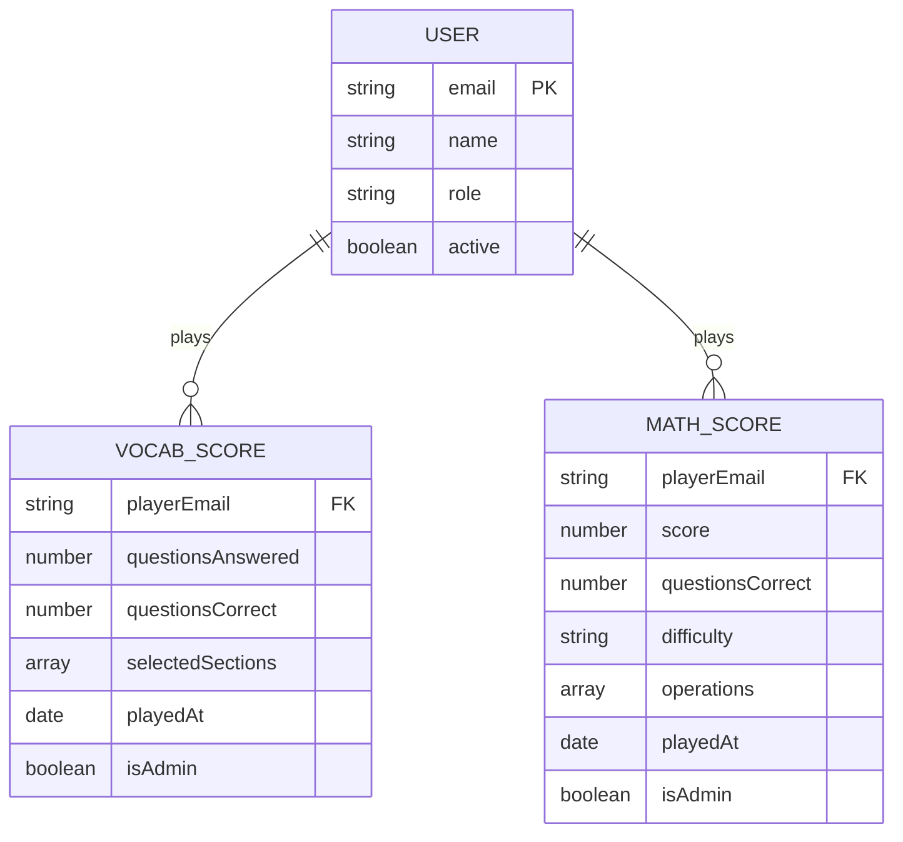

### 5. API Architecture

#### RESTful API Design
```
POST /api/vocab-quiz/scores      # Save vocabulary quiz results
GET  /api/vocab-quiz/leaderboard # Fetch vocabulary leaderboard

POST /api/mental-math/scores     # Save mental math results
GET  /api/mental-math/leaderboard # Fetch math leaderboards

POST /api/auth/[...nextauth]     # NextAuth.js handlers
```

#### API Request Flow
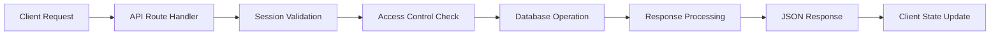

#### Error Handling Strategy
```typescript
// Standardized error responses
{
  error: string,           // Human-readable message
  code: string,           // Error code for client handling
  details?: any,          // Additional error information
  timestamp: Date         // When error occurred
}

// HTTP Status Codes
401: Unauthorized (no session)
403: Forbidden (no access)
400: Bad Request (invalid data)
500: Internal Server Error
```

## External Service Integration

### 1. Google Gemini AI Integration

#### Question Generation Pipeline
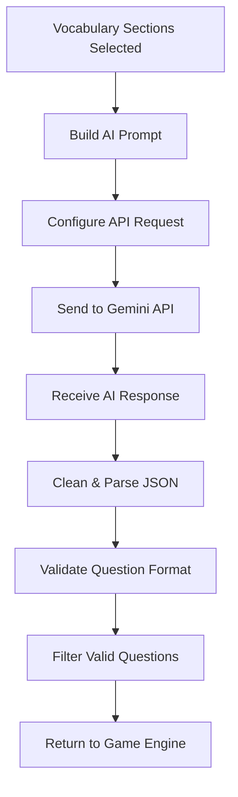

#### API Configuration
```typescript
// Gemini API Setup
const API_ENDPOINT = 'https://generativelanguage.googleapis.com/v1beta/models/gemini-2.5-flash-lite:generateContent';
const API_KEY = process.env.GOOGLE_GEMINI_API_KEY;

// Request Structure
{
  contents: [{
    parts: [{
      text: constructedPrompt
    }]
  }]
}
```

### 2. Google OAuth Integration

#### Authentication Flow
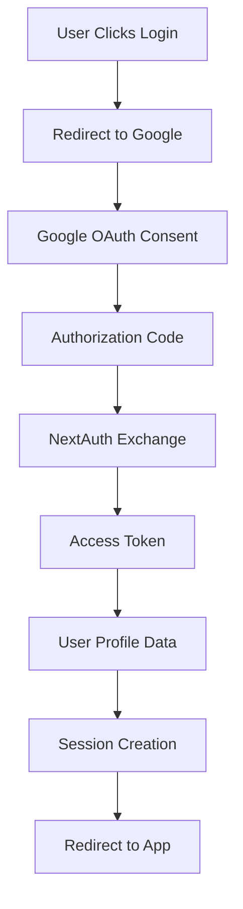

### 3. EmailJS Integration

#### Contact Form Processing
```typescript
// Form submission pipeline
User Input → Validation → EmailJS API → Email Delivery → Confirmation
```

## Performance Architecture

### 1. Frontend Optimizations

#### Code Splitting Strategy
```typescript
// Route-based splitting (automatic)
pages/games/vocab-quiz → vocab-quiz.js
pages/games/mental-math → mental-math.js

// Component-based splitting (manual)
const HeavyComponent = dynamic(() => import('./HeavyComponent'));
```

#### Caching Layers
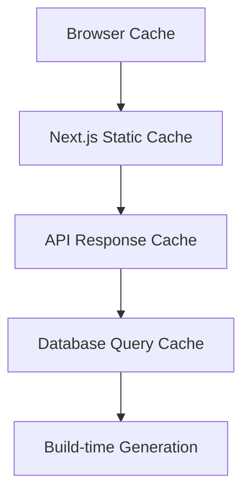

### 2. Backend Optimizations

#### Database Performance
```typescript
// Efficient aggregation pipelines
VocabLeaderboard: Group by email → Sum questions → Sort by total
MathLeaderboard: Dual queries for individual + accumulated scores

// Index optimization
- Compound indexes for common query patterns
- Background index building for minimal downtime
```

#### API Response Optimization
```typescript
// Lean queries to reduce data transfer
.select('playerName score questionsCorrect questionsAnswered')
.lean() // Return plain objects instead of Mongoose documents

// Pagination for large datasets
.limit(20) // Top 20 leaderboard entries
```

### 3. Build-Time Optimizations

#### Access Control Generation
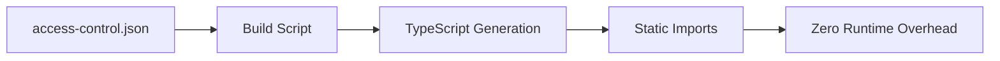

## Security Architecture

### 1. Authentication Security

#### Multi-Layer Protection
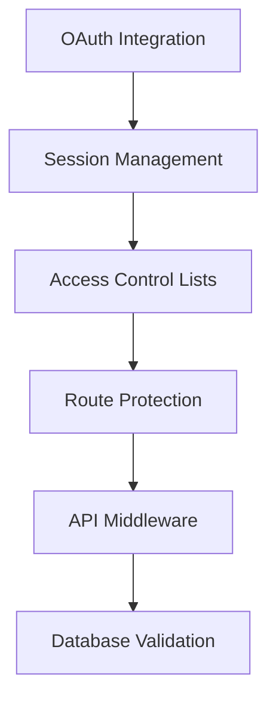

#### Session Security
```typescript
// NextAuth.js Security Features
- JWT tokens with rotation
- Secure HTTP-only cookies
- CSRF protection
- Session timeout handling
```

### 2. Data Security

#### Input Validation
```typescript
// API route validation
const schema = {
  questionsAnswered: { type: 'number', min: 0 },
  questionsCorrect: { type: 'number', min: 0 },
  selectedSections: { type: 'array', items: 'number' }
};
```

#### Database Security
```typescript
// Mongoose security features
- Schema validation
- Query sanitization
- Connection encryption (MongoDB Atlas)
- Role-based access control
```

## Scalability Architecture

### 1. Horizontal Scaling

#### Stateless Design
- **No server-side sessions** (JWT tokens)
- **Database-backed state** for persistence
- **API route isolation** for independent scaling

#### Database Scaling
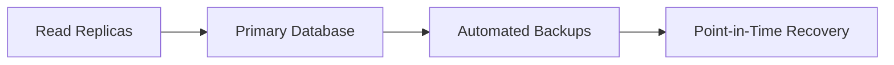

### 2. Vertical Scaling

#### Performance Monitoring
```typescript
// Key metrics to monitor
- API response times
- Database query performance
- Memory usage patterns
- CPU utilization
```

#### Caching Strategy
```typescript
// Multi-level caching
1. Browser cache (static assets)
2. CDN cache (global distribution)
3. Application cache (API responses)
4. Database cache (query results)
```

## Deployment Architecture

### 1. Production Environment

#### Vercel Deployment
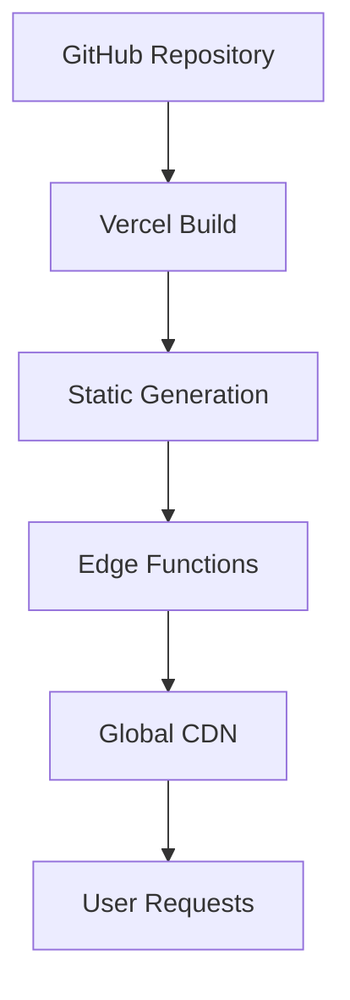

#### Environment Configuration
```typescript
// Production environment variables
NEXTAUTH_URL=https://vh-website.vercel.app
MONGODB_URI=mongodb+srv://production-cluster
GOOGLE_CLIENT_ID=production-oauth-id
GOOGLE_CLIENT_SECRET=production-oauth-secret
```

### 2. Development Environment

#### Local Development Setup
```bash
# Development workflow
npm run generate:access-control  # Build access control
npm run dev                     # Start development server
npm run build                   # Test production build
```

## Monitoring and Analytics

### 1. Performance Monitoring

#### Key Metrics
- **Page load times** - Core Web Vitals tracking
- **API response times** - Database query performance
- **Error rates** - Application stability metrics
- **User engagement** - Game completion rates

### 2. Business Analytics

#### User Behavior Tracking
```typescript
// Analytics events
- Game starts/completions
- Score achievements
- Leaderboard views
- Session durations
```

## System Integration Points

### 1. Component Connections

#### Authentication → Games
```typescript
// Session provides user context for score saving
const { data: session } = useSession();
await saveScore({
  playerEmail: session.user.email,
  playerName: session.user.name,
  ...gameResults
});
```

#### Games → Database
```typescript
// Scores link to user accounts
MathScore.playerEmail → User.email
VocabScore.playerEmail → User.email
```

#### Database → Leaderboards
```typescript
// Aggregation queries for competitive rankings
const leaderboard = await Model.aggregate([
  { $match: { isAdmin: { $ne: true } } },
  { $group: { /* aggregation logic */ } },
  { $sort: { totalScore: -1 } }
]);
```

### 2. Data Flow Integration

#### End-to-End User Journey
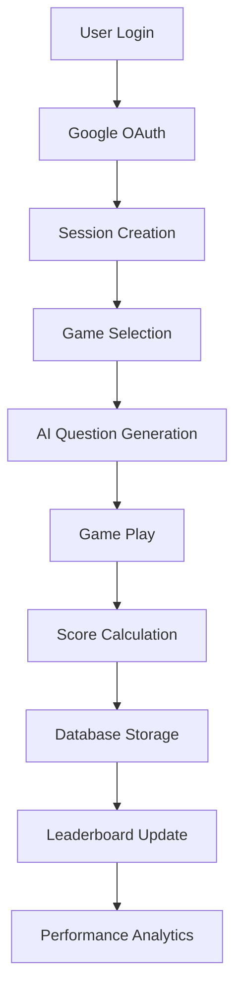

This architecture provides a robust, scalable foundation that supports current features while being extensible for future enhancements. The modular design ensures maintainability and allows for independent development and deployment of system components.