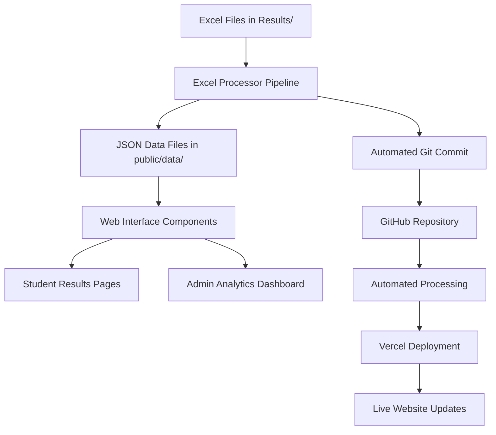
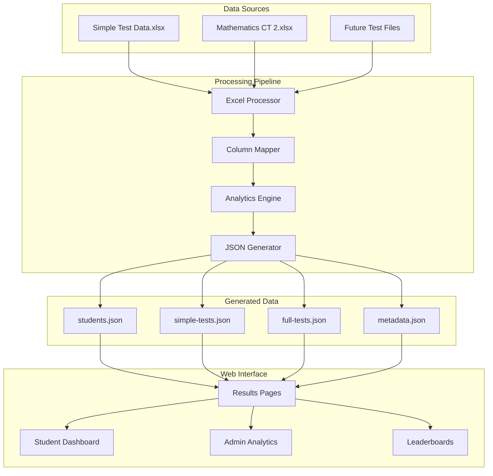

# VH Website Results System Documentation

## Overview

The VH Website Results System is a comprehensive test data management solution that processes Excel files containing student test results and transforms them into a web-accessible format. The system provides detailed analytics, performance tracking, and data visualization for both students and administrators.

## System Architecture

### High-Level Data Flow



### Component Interconnections



## Core Components

### 1. Excel Processing Pipeline

#### Location: `scripts/`

The processing pipeline consists of several interconnected modules:

#### Excel Processor (`scripts/excel-processor.js`)
**Purpose**: Main orchestrator for processing Excel files into JSON data

**Key Responsibilities**:
- Scans `Results/` directory for Excel files
- Identifies test types (Simple vs Full tests)
- Coordinates column mapping and data extraction
- Generates final JSON output files
- Provides comprehensive error handling and logging

**Processing Flow**:
```javascript
class ExcelProcessor {
  // 1. Initialize and scan Results directory
  initialize() → loadStudentsData() → scanForFiles()

  // 2. Process each Excel file
  processExcelFile() → {
    if (simpleTest) → processSimpleTestFile()
    if (fullTest) → processFullTestFile()
  }

  // 3. Generate output files
  generateJSONFiles() → {
    students.json,
    simple-tests.json,
    full-tests.json,
    metadata.json
  }
}
```

#### Column Mapper (`scripts/column-mapper.js`)
**Purpose**: Intelligent column detection and mapping for flexible Excel formats

**Key Features**:
- **Fuzzy String Matching**: Handles variations in column names (e.g., "Student ID", "student_id", "ID")
- **Pattern Recognition**: Detects section-based columns (s1_correct, s2_wrong, etc.)
- **Validation System**: Ensures required columns are present
- **Format Flexibility**: Adapts to different Excel file structures

**Example Mappings**:
```javascript
// Basic mappings
'student id' → 'studentId'
'correct' → 'correct'
'wrong' → 'wrong'

// Section-based mappings
's1_correct' → sections[1].correct
's2_wrong' → sections[2].wrong
'total_score' → totalScore

// Essay mappings
'essay 1' → essays.essay1
'essay 2' → essays.essay2
```

#### Analytics Engine (`scripts/analytics-engine.js`)
**Purpose**: Comprehensive statistical analysis and performance metrics

**Analytics Capabilities**:

1. **Basic Analytics**:
   - Score calculation and validation
   - Accuracy percentages
   - Question-level performance

2. **Advanced Analytics**:
   - **Percentile Rankings**: Student position relative to class
   - **Class Statistics**: Mean, median, standard deviation
   - **Performance Trends**: Score progression over time
   - **Section Analysis**: Strength/weakness identification

3. **Competitive Analytics**:
   - **Skip Strategy Analysis**: Strategic question skipping patterns
   - **Recovery Scores**: Bounce-back performance after mistakes
   - **Question Choice Strategy**: Multiple choice selection patterns

**Example Analytics Output**:
```typescript
interface StudentAnalytics {
  basicAnalytics: {
    score: number;
    accuracy: number;
    questionsAttempted: number;
  };
  classStats: {
    percentile: number;
    rank: number;
    classAverage: number;
  };
  performance: {
    skipStrategy: number;      // Strategic skipping effectiveness
    recoveryScore: number;     // Bounce-back ability
    consistency: number;       // Performance stability
  };
}
```

### 2. Data Structure and Types

#### Location: `src/types/results.ts`

**Comprehensive Type Definitions**:

```typescript
// Core student data
interface StudentData {
  studentId: string;
  name: string;
  email: string;
  class?: string;
  batch?: string;
}

// Simple test results (quizzes, small tests)
interface SimpleTestResult {
  testName: string;
  testType: 'simple';
  studentId: string;
  studentName: string;

  // Core performance metrics
  score: number;
  correct: number;
  wrong: number;
  totalQuestions: number;
  accuracy: number;

  // Section-based analysis
  sections: {
    [key: string]: {
      correct: number;
      wrong: number;
      totalQuestions: number;
      accuracy: number;
    };
  };

  // Essay components
  essays: {
    [key: string]: number;
  };

  // Advanced analytics
  analytics: StudentAnalytics;

  // Metadata
  dateCompleted?: Date;
  timeSpent?: number;
  rank?: number;
}

// Full test results (major exams)
interface FullTestResult {
  testName: string;
  testType: 'full';
  testSeries?: string;

  // Extended analytics for comprehensive tests
  sectionAnalytics: {
    [sectionId: string]: {
      questionsCorrect: number;
      questionsWrong: number;
      questionsSkipped: number;
      sectionScore: number;
      timeSpent?: number;
    };
  };

  // Individual question responses
  questionResponses: {
    [questionId: string]: {
      response: string;
      correct: boolean;
      timeSpent?: number;
    };
  };

  // All SimpleTestResult properties
  extends SimpleTestResult;
}
```

### 3. Generated Data Files

#### Location: `public/data/`

The processing pipeline generates four key JSON files:

#### `students.json` (~3KB)
**Purpose**: Central student registry
```json
{
  "students": [
    {
      "studentId": "757516",
      "name": "Abrar Bin Masud",
      "email": "abrarmasud20@gmail.com",
      "class": "DU-FBS",
      "batch": "2025"
    }
  ],
  "totalStudents": 24,
  "lastUpdated": "2025-01-XX"
}
```

#### `simple-tests.json` (~175KB)
**Purpose**: All quiz and small test results with analytics
```json
{
  "tests": {
    "Mathematics CT 1": [
      {
        "studentId": "757516",
        "studentName": "Abrar Bin Masud",
        "score": 85,
        "correct": 17,
        "wrong": 3,
        "accuracy": 85.0,
        "analytics": {
          "percentile": 78,
          "rank": 5,
          "skipStrategy": 0.85
        }
      }
    ]
  },
  "metadata": {
    "totalTests": 9,
    "totalResults": 216,
    "testTypes": ["Mathematics", "English"]
  }
}
```

#### `full-tests.json` (~50KB)
**Purpose**: Comprehensive exam results with detailed analytics
```json
{
  "tests": {
    "Mathematics CT 2": [
      {
        "testType": "full",
        "testSeries": "CT",
        "sectionAnalytics": {
          "section1": {
            "questionsCorrect": 8,
            "questionsWrong": 2,
            "questionsSkipped": 0
          }
        },
        "questionResponses": {
          "Section1-Q1": {
            "response": "B",
            "correct": true
          }
        }
      }
    ]
  }
}
```

#### `metadata.json` (~0.2KB)
**Purpose**: System-wide statistics and processing information
```json
{
  "lastUpdated": "2025-01-XX",
  "totalTests": 10,
  "simpleTestsCount": 9,
  "fullTestsCount": 1,
  "totalStudents": 24,
  "processingStats": {
    "filesProcessed": 2,
    "totalResults": 240,
    "processingTime": "1.2s"
  }
}
```

### 4. Automated Processing System

#### Update Script (`update-tests.bat`)
**Purpose**: One-click processing and deployment pipeline

**Process Flow**:
1. **Environment Check**: Verify Node.js installation
2. **File Validation**: Confirm Excel files in Results directory
3. **Processing**: Execute Excel processor with full analytics
4. **Access Control**: Update user permissions if needed
5. **Git Operations**: Automatic commit and push to GitHub
6. **Deployment**: Triggers Vercel deployment

**Usage**:
```bash
# Manual execution
update-tests.bat

# The script handles:
# - Processing 2 Excel files → 4 JSON files
# - Generating 240+ test results
# - Committing to GitHub
# - Deploying to production
```

#### Processing Output Example:
```
🚀 Starting Excel Processing Pipeline

📊 Processing: Simple Test Data.xlsx
  📄 Processing sheet: Mathematics CT 1 → ✅ 23 students
  📄 Processing sheet: English Test 1 → ✅ 23 students
  📄 Processing sheet: English Quiz 1 → ✅ 24 students
  📄 Processing sheet: English Quiz 3 → ✅ 24 students
  [... 5 more quizzes]

📊 Processing: Mathematics CT 2.xlsx
  📊 Processing full test → ✅ 24 students

📁 Generating JSON files...
  ✅ students.json: 2.92KB
  ✅ simple-tests.json: 171.38KB
  ✅ full-tests.json: 49.51KB
  ✅ metadata.json: 0.23KB

🎉 All processing completed successfully!
```

## Web Interface Integration

### 1. Data Access Patterns

#### Client-Side Data Loading
```typescript
// Fetch all student results
const response = await fetch('/data/simple-tests.json');
const { tests } = await response.json();

// Filter by student
const studentResults = Object.values(tests)
  .flat()
  .filter(result => result.studentId === currentStudentId);

// Calculate progress metrics
const progressData = calculateStudentProgression(studentResults);
```

#### Server-Side Integration
```typescript
// API route for dynamic data
// app/api/results/[studentId]/route.ts
export async function GET(request: Request, { params }: { params: { studentId: string } }) {
  const simpleTests = await import('../../../../public/data/simple-tests.json');
  const fullTests = await import('../../../../public/data/full-tests.json');

  const studentData = aggregateStudentResults(simpleTests, fullTests, params.studentId);

  return NextResponse.json(studentData);
}
```

### 2. Component Architecture for Results

#### Results Dashboard Structure
```tsx
// app/results/page.tsx
export default function ResultsDashboard() {
  return (
    <ProtectedRoute>
      <div className="results-dashboard">
        <StudentSelector />
        <TestOverview />
        <PerformanceCharts />
        <DetailedAnalytics />
      </div>
    </ProtectedRoute>
  );
}
```

#### Student Results View
```tsx
// components/StudentResults.tsx
interface StudentResultsProps {
  studentId: string;
  results: TestResult[];
}

export function StudentResults({ studentId, results }: StudentResultsProps) {
  const progressionData = calculateProgression(results);
  const analytics = generateAnalytics(results);

  return (
    <Card>
      <ScoreProgressionChart data={progressionData} />
      <PerformanceMetrics analytics={analytics} />
      <TestResultsList results={results} />
    </Card>
  );
}
```

#### Admin Analytics Dashboard
```tsx
// components/AdminAnalytics.tsx
export function AdminAnalytics() {
  const classStats = calculateClassStatistics();
  const testComparisons = generateTestComparisons();

  return (
    <div className="admin-dashboard">
      <ClassOverviewStats stats={classStats} />
      <TestPerformanceComparison data={testComparisons} />
      <StudentRankings />
      <TestAnalytics />
    </div>
  );
}
```

### 3. Authentication Integration

#### Access Control for Results
```typescript
// Integrate with existing VH auth system
import { getServerSession } from "next-auth/next";
import { authOptions } from "@/lib/auth";
import { isAuthorizedUser, getUserRole } from "@/lib/generated-access-control";

export async function ResultsPage() {
  const session = await getServerSession(authOptions);

  if (!session || !isAuthorizedUser(session.user.email)) {
    redirect('/auth/signin');
  }

  const userRole = getUserRole(session.user.email);
  const canViewAllResults = userRole === 'admin' || userRole === 'super_admin';

  return (
    <ResultsInterface
      currentUser={session.user}
      canViewAll={canViewAllResults}
    />
  );
}
```

## Data Processing Details

### 1. Excel File Format Support

#### Simple Test Format
```
| Student ID | Name | Correct | Wrong | Score | Rank | s1_correct | s1_wrong | Essay 1 |
|------------|------|---------|-------|-------|------|------------|----------|---------|
| 757516     | Name | 17      | 3     | 85    | 5    | 8          | 1        | 15      |
```

#### Full Test Format
```
Sheet1: Main Results
| Student ID | Name | 1 Correct | 1 Wrong | 1 Marks | Total Marks | Rank |

Sheet2: Top Questions Analytics
| Question | Correct Rate | Difficulty | Most Common Wrong Answer |

Sheet3: Individual Responses
| Roll | Section1-Q1 | Section1-Q2 | Section2-Q1 | ... |
```

### 2. Error Handling and Validation

#### Processing Safeguards
```javascript
// Column validation
function validateColumns(detectedColumns, requiredColumns) {
  const missing = requiredColumns.filter(col => !detectedColumns[col]);
  if (missing.length > 0) {
    throw new ValidationError(`Missing required columns: ${missing.join(', ')}`);
  }
}

// Data sanitization
function sanitizeScore(score) {
  const numScore = parseFloat(score);
  return isNaN(numScore) ? 0 : Math.max(0, numScore);
}

// Comprehensive error reporting
class ProcessingError extends Error {
  constructor(message, context) {
    super(message);
    this.context = context; // { file, sheet, row, column }
    this.timestamp = new Date();
  }
}
```

### 3. Performance Optimizations

#### Large File Handling
- **Streaming Processing**: Process Excel files in chunks for memory efficiency
- **Lazy Loading**: Load only required sheets and columns
- **Caching**: Cache processed results to avoid reprocessing
- **Compression**: GZIP compression for JSON output files

#### Build-Time Optimizations
- **Static Generation**: Pre-process data at build time when possible
- **Incremental Updates**: Only reprocess changed files
- **Parallel Processing**: Process multiple sheets simultaneously

## Analytics and Insights

### 1. Student Performance Analytics

#### Individual Metrics
```typescript
interface StudentAnalytics {
  // Performance trends
  scoreProgression: {
    testName: string;
    score: number;
    date: Date;
    trend: 'improving' | 'declining' | 'stable';
  }[];

  // Strengths and weaknesses
  subjectAnalysis: {
    [subject: string]: {
      averageScore: number;
      consistencyRating: number;
      improvementTrend: number;
    };
  };

  // Competitive position
  classRanking: {
    currentRank: number;
    totalStudents: number;
    percentile: number;
    rankingTrend: 'rising' | 'falling' | 'stable';
  };
}
```

#### Class-Wide Analytics
```typescript
interface ClassAnalytics {
  // Distribution analysis
  scoreDistribution: {
    ranges: string[];
    counts: number[];
    percentages: number[];
  };

  // Test difficulty analysis
  testDifficulty: {
    testName: string;
    averageScore: number;
    standardDeviation: number;
    difficultyRating: 'easy' | 'medium' | 'hard';
  }[];

  // Progress tracking
  classProgress: {
    overallImprovement: number;
    topPerformers: StudentSummary[];
    strugglingStudents: StudentSummary[];
  };
}
```

### 2. Predictive Analytics

#### Performance Prediction
- **Trend Analysis**: Predict future performance based on historical data
- **Weakness Identification**: Identify areas needing improvement
- **Intervention Alerts**: Flag students who may need additional support

#### Test Optimization
- **Question Analysis**: Identify questions that are too easy/hard
- **Time Management**: Analyze optimal time allocation strategies
- **Format Effectiveness**: Compare different test formats and their outcomes

## Integration with VH Website

### 1. Design System Compliance

#### Brand Colors and Styling
```css
/* VH Brand Colors - from existing design system */
.results-card {
  background: linear-gradient(135deg, var(--color-vh-red) 0%, var(--color-vh-dark-red) 100%);
  border-radius: 24px; /* Consistent with existing components */
}

.score-positive {
  color: var(--color-vh-red);
}

.score-improvement {
  background: linear-gradient(to-right, var(--color-vh-beige), var(--color-vh-red));
}
```

#### Component Consistency
- **Cards**: Use existing Card component patterns
- **Buttons**: Follow PrimaryButton/SecondaryButton styles
- **Typography**: Maintain font hierarchy and spacing
- **Animations**: Use existing transition patterns

### 2. Navigation Integration

#### Header Menu Addition
```tsx
// Update existing Header component
const navigationItems = [
  { name: 'Home', href: '/' },
  { name: 'Games', href: '/games' },
  { name: 'Results', href: '/results' }, // New addition
  { name: 'University Tools', href: '/university' }
];
```

#### Protected Route Setup
```tsx
// app/results/page.tsx
export default function ResultsPage() {
  return (
    <ProtectedRoute>
      <ResultsDashboard />
    </ProtectedRoute>
  );
}
```

### 3. Database Integration (Future Enhancement)

#### MongoDB Schema Design
```typescript
// Future: Store results in MongoDB instead of JSON files
const ResultSchema = new mongoose.Schema({
  studentId: { type: String, required: true },
  testName: { type: String, required: true },
  testType: { type: String, enum: ['simple', 'full'] },
  score: { type: Number, required: true },
  analytics: {
    percentile: Number,
    rank: Number,
    skipStrategy: Number
  },
  dateCompleted: { type: Date, default: Date.now },
  isAdmin: { type: Boolean, default: false }
});
```

## Deployment and Maintenance

### 1. Automated Deployment Pipeline

#### GitHub Actions Workflow (Future)
```yaml
name: Process and Deploy Results
on:
  push:
    paths: ['Results/*.xlsx']

jobs:
  process-results:
    runs-on: ubuntu-latest
    steps:
      - uses: actions/checkout@v2
      - name: Setup Node.js
        uses: actions/setup-node@v2
      - name: Process Excel Files
        run: node scripts/excel-processor.js
      - name: Commit Results
        run: |
          git add public/data/
          git commit -m "Auto-update test results"
          git push
```

#### Vercel Integration
- **Automatic Deployment**: Triggered by GitHub commits
- **Build Optimization**: Static generation of results pages
- **CDN Distribution**: Fast global access to JSON data files

### 2. Monitoring and Alerts

#### Processing Health Checks
```javascript
// Monitor processing success
function validateProcessingResults(outputFiles) {
  const checks = [
    { file: 'students.json', minSize: 1000 },
    { file: 'simple-tests.json', minSize: 50000 },
    { file: 'metadata.json', minSize: 100 }
  ];

  return checks.every(check => {
    const fileSize = fs.statSync(`public/data/${check.file}`).size;
    return fileSize >= check.minSize;
  });
}
```

#### Error Reporting
- **Processing Failures**: Alert when Excel processing fails
- **Data Integrity**: Validate JSON file structure
- **Performance Monitoring**: Track processing times and file sizes

## Future Enhancements

### 1. Advanced Features

#### Real-Time Updates
- **Live Results**: Process and display results in real-time
- **Push Notifications**: Alert students when new results are available
- **Collaborative Analytics**: Share insights between teachers and students

#### Machine Learning Integration
- **Performance Prediction**: ML models for student outcome prediction
- **Personalized Recommendations**: Tailored study suggestions
- **Anomaly Detection**: Identify unusual patterns in test results

### 2. Mobile Application
- **React Native App**: Native mobile interface for results
- **Offline Access**: Cache results for offline viewing
- **Push Notifications**: Real-time result updates

### 3. Advanced Analytics Dashboard
- **Interactive Visualizations**: D3.js charts and graphs
- **Custom Reports**: Generate PDF/Excel reports
- **Comparative Analysis**: Multi-test and multi-student comparisons

## Technical Specifications

### Performance Requirements
- **Processing Speed**: Handle 1000+ student results in <10 seconds
- **Memory Usage**: Process large Excel files efficiently
- **Response Time**: Web interface loads in <2 seconds
- **Scalability**: Support 100+ concurrent users

### Browser Compatibility
- **Modern Browsers**: Chrome 90+, Firefox 88+, Safari 14+
- **Mobile Support**: iOS Safari, Android Chrome
- **Responsive Design**: 320px to 4K displays

### Security Considerations
- **Data Privacy**: Student information protection
- **Access Control**: Role-based result access
- **Audit Trail**: Track all data access and modifications
- **Secure Storage**: Encrypted sensitive data

---

**Last Updated**: January 2025
**Version**: 1.0.0
**Implementation Status**: Data processing complete, web interface development ready to begin

This documentation provides the complete technical foundation for implementing and maintaining the VH Website Results System, ensuring seamless integration with existing systems while providing powerful analytics and insights for educational excellence.